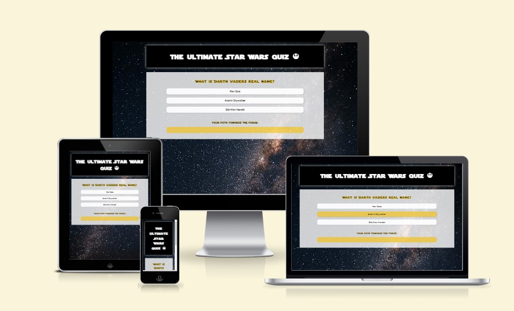
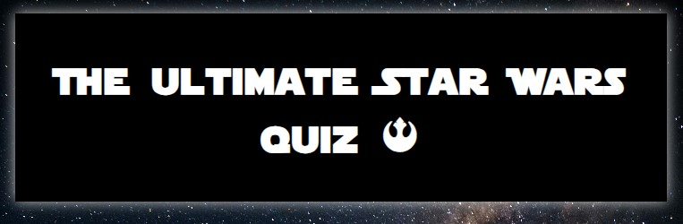
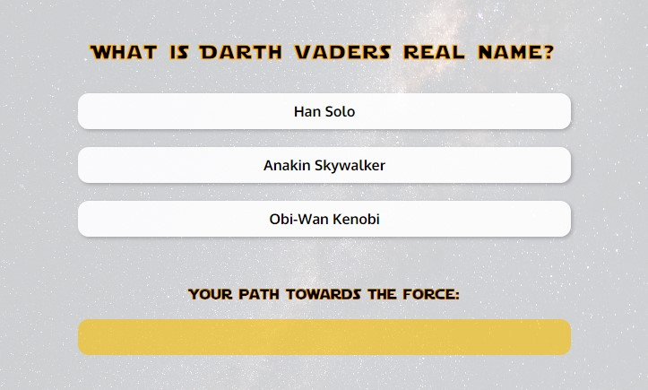
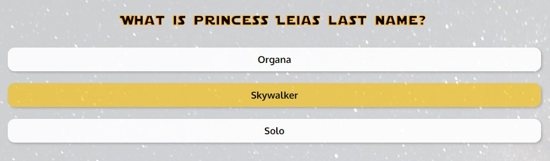
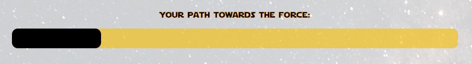
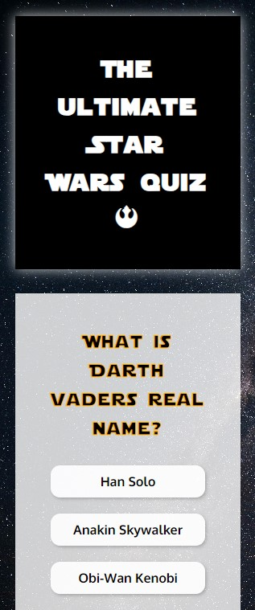
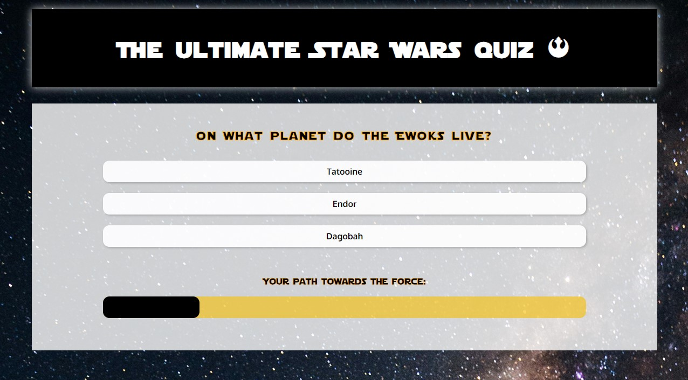
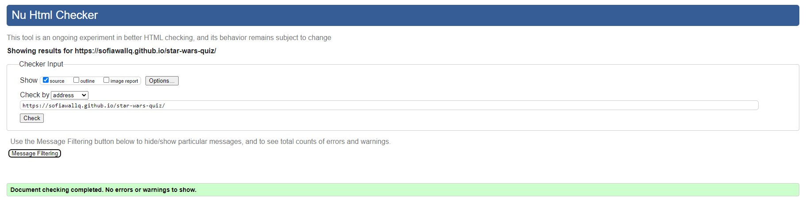
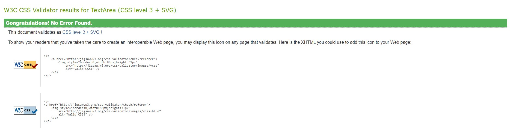

# The ultimate Star Wars quiz

As the headline suggests, this page is all about Star Wars. It features a quiz with ten questions of various difficulty that will amuse both the hardcore fan of Star Wars and the user who is new to this universe.

## Features
The Star Wars quiz page consists of one landing page that instantly takes the user to the quiz/game area. Instead of making different pages for the quiz itself, the users score and rules for the quiz I let JavaScript do the talking for this project. 

### Existing Features

### Header
- The header is pretty straight forward - it tells the user what they will encounter on the website. 

### Quiz area
- The quiz area is mainly where the action is - here the user gets to answer 10 questions of various difficulty about the Star Wars Universe. The layout is simple and user friendly with the question at the top of the section, and three answers in the shape of buttons to choose from below. 

- The quiz automatically takes the user to the next question when an answer is given/button is pressed. To make it more user friendly all the buttons change colour and has a hover-effect in the form of a changed cursor when the user hovers over them, simply to make it more clear which answer they are choosing.

- One of the questions also has an image incorporated in the quiz area, to make it a bit more visual. If given the time I would love to have a visual element incorporated with all questions, but for now this serves as an example of a JavaScript feature. 

### Progress bar
- The quiz features a progress bar that tells the user how far along into the quiz they are. 

### Score/Result pop-up
- When the user has finished the quiz and answered all ten questions their final scores pop up on the screen. Along with a comment about their score, which changes depending on how high their score is.
- Here you also have the option to give the quiz another go if you push the "Play again?"-button which reloads the quiz.

### Features left to Implement
There is a couple of features that I would have wanted to incorporate into the page if the time was given:
- A score board that saves your scores.
- The option to put in a user name and connect it to your score board.
- Some different quiz to choose from, with the possibility of chosing your preffered degree of difficulty.
- A pop-up section with instructions if the page would have the above features (For now the design and approach is simple enough that instructions feels superfluous).

## Design choices
- The chosen colours for the webpage are loosely based on the colour scheme of the movie intros. 
- The same goes for the font on headlines and questions, it's the same font they use for the movies. 
- The background image hopefully gives a galaxy vibe to the quiz. 

## Testing
- The page has been tested on different devices - such as phones, tablets and laptops. Among others the page has been tested on Samsung S22, Iphone 11, Apple Ipad, Goolge Chromebook and a wide screen desktop.
- When it comes to phones it has been viewed on different models to make sure it looks the same depending on the brand and screen size of the phone.
- It has been tested in different web browsers such as Google Chrome, Microsoft Edge, Safari and Mozilla Firefox to make sure everything acts as it should.
- Responsivness has been tested on devices as small as 280px in screen size up to 2560px, with the help of Chrome DevTools. On screens sizes over 1200px wide the width becomes fixed so the content won't stretch on wide screens. 
- No elements overlap when viewed on smaller screens. Every element aligns itself in a column when viewed on smaller screens. 

## Validator testing
- HTML - no errors was returned when the page was tested through the official W3C validator.

- CSS - no errors was returned when tested through the official Jigsaw validator.

- When testing the accessibility using Lighthouse for Chrome,

## Unfixed bugs

## Deployment

The website was deployed using a hosting platform in the form of GitHub. The steps to deploy are as follows:

1. In the GitHub repository of the project, navigate to the "Settings"-tab
2. Select "Pages" in the left-hand menu and in the "Source" drop-down menu select "Deploy from a branch"
3. In the "Branch" section below chose the main branch
4. When the main branch is selected the GitHub repository will automatically refresh and after a little while you will find the Deployed page on the right-hand side with a detailed list of every updated deployment going forward.

The link to the live project-site can be found here: 

## Credits

### Content
- The font for the header and questions were found at

- Box-shadows: https://developer.mozilla.org/en-US/play
-
- Code structure for scrpt.js from the help of my mentor

### Media

Favicon
Background Image from Pexels

